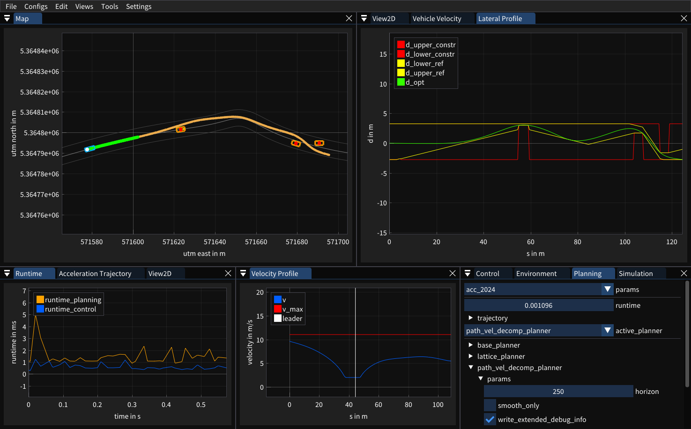

# tpl

This is an experimental trajectory planning library (tpl) for automated vehicles.
It allows one to quickly and interactively experiment with new planning approaches.

It is used at our [institute](https://www.uni-ulm.de/in/mrm/) for research on real-world vehicles.



## Features

- two fast, gpu-based dynamic programming methods for combined planning and decision finding
- an iterative, constrained, spatial trajectory planning method
- multiple practical (MPC) controllers with deadtime compensation
- hot code reloading functionality (via [minireload](https://github.com/joruof/minireload))
- modular architectur with simple shared memory IPC (via [structstore](https://github.com/mertemba/structstore)) 
- an interactive and customizeable GUI (via [imviz](https://github.com/joruof/imviz) and [imdash](https://github.com/uulm-mrm/imdash))
- genopt: a library to generate C code for fast, self-contained optimal control solvers
- a tiny, integrated simulation environment (really simple, don't expect too much)

## Quickstart

As quickstart you can use the included docker environment. To build the environment run:
```
./docker/run_docker.sh
```
This automatically builds the container and installs the library into the container.

Afterwards the integrated GUI can be executed with:
```
tplgui
```

Note that the GUI is started in a separate process and attaches to the running
planning/control process via shared memory IPC. This mean that, as long as
there is no planning/control process running, the gui may show errors.

You can select a gui configuration from the "Configs" menu in the menu bar.
For the simple demo scenario we recommend to start with the "planning" config.

An exemplary simulated scenario can be started by executing
```
tplsim --scenario default
```
in a separate terminal (or tmux tab) inside the docker container.

Note: By default the library provides hot code reloading for python code.
This means that changes in the python code are reloaded live at runtime.

## Citation

```
@inproceedings{RSTP_2023
  author={Ruof, Jona and Mertens, Max Bastian and Buchholz, Michael and Dietmayer, Klaus},
  booktitle={2023 IEEE Intelligent Vehicles Symposium (IV)}, 
  title={Real-Time Spatial Trajectory Planning for Urban Environments Using Dynamic Optimization}, 
  year={2023},
  doi={10.1109/IV55152.2023.10186535}
}
```

```
@inproceedings{RSTP_2024
  author={Ruof, Jona and Mertens, Max Bastian and Buchholz, Michael and Dietmayer, Klaus},
  booktitle={2024 American Control Conference (ACC)}, 
  title={Real-Time Spatial Trajectory Planning Under Lateral Contraints}, 
  year={2024},
}
```

```
@inproceedings{FAS_2025
  author={Ruof, Jona and Dietmayer, Klaus},
  booktitle={16. Uni-DAS e.V. Workshop Fahrerassistenz und automatisiertes Fahren}, 
  title={Accelerated Dynamic Programming for Trajectory Planning of Automated Vehicles}, 
  year={2025},
}
```

## License

This code is released under the Apache 2.0 license.
